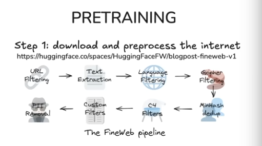
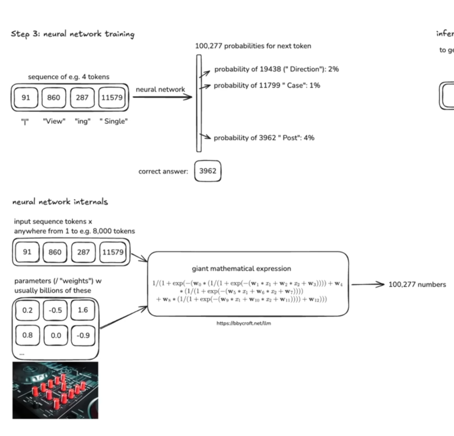
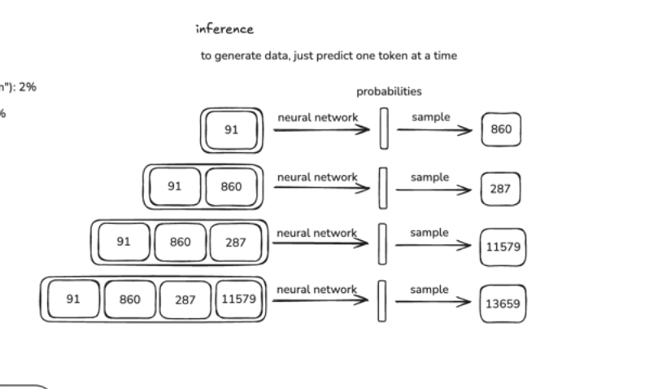

# deep dive into LLMs like ChatGPT

‍

# 一. 预处理

## Step1: 下载并处理internet

- 互联网上的网页仅针对文本进行了各种过滤,现在已经有了大量40TB的文本,

## Step2: tokenization

- 一个分词器地址:[ https://tiktokenizer.vercel.app/](https://tiktokenizer.vercel.app/)

- text 和 sequences of symbols(tokens)的互相转化
- run the byte pair encoding algorithm

## Step3: 神经网络训练

---

## [notebookllm总结](obsidian://open?vault=CS146S&file=Week%201%2Fdeep%20dive%20into%20LLMs%20like%20ChatGPT%2F%E9%A2%84%E5%A4%84%E7%90%86)

‍
